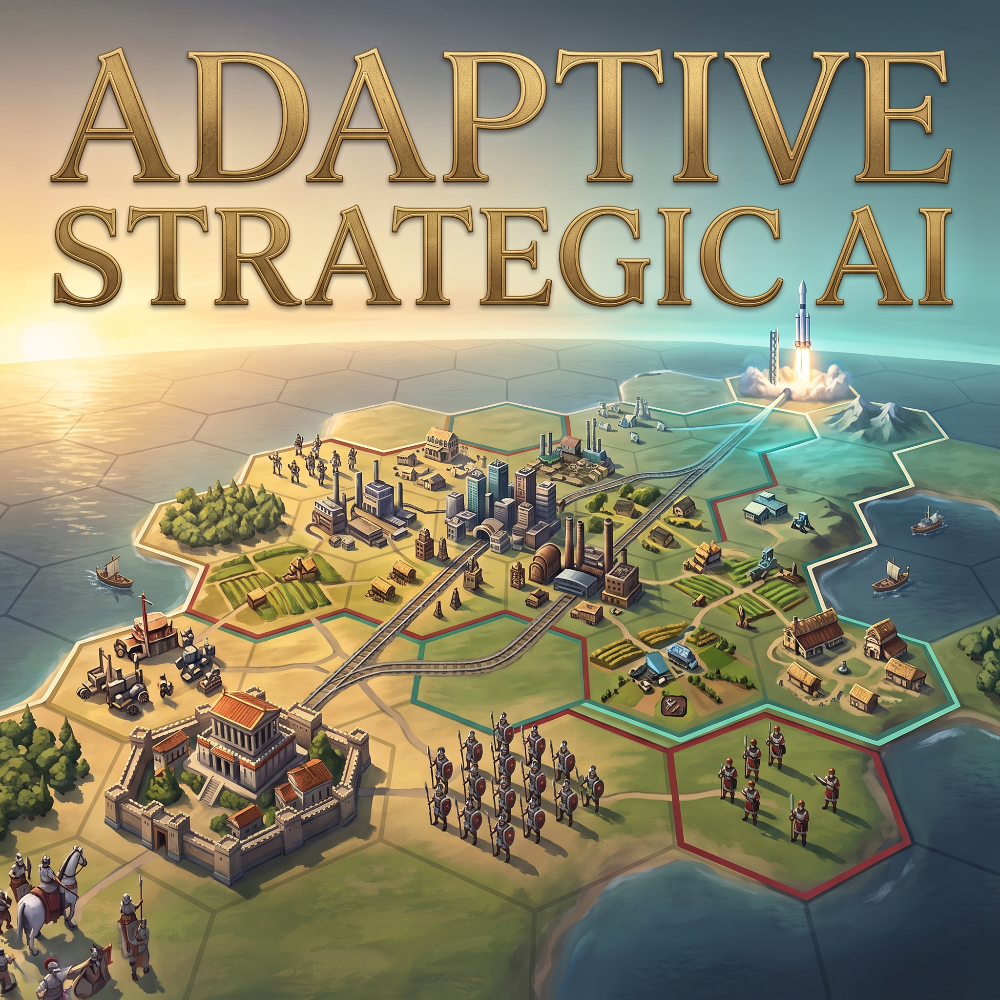

[English](README.md) | **简体中文**

[](https://steamcommunity.com/sharedfiles/filedetails/?id=3800723472)
[](https://github.com/CHOS1N11111/Adaptive-Strategic-AI-mod-for-Civilization-VI/releases/latest)
[](LICENSE)

# Adaptive Strategic AI

面向 **《文明 VI：风云变幻》** 的 AI 增强 Mod：让**神级**对局不只是熬过开局，而是在发展、战争和胜利冲刺中持续面对竞争。

## 主要特点

- **难度不只集中在开局。** 缓和开局堆叠，随时代增强 AI 的后续竞争力。
- **每个 AI 都会调整。** 根据局势变化，重新分配发展、军事和胜利目标的优先级。
- **更重视实际成果。** 改善贸易、补军，以及科研领先向科技胜利项目的转化。
- **有边界的追赶。** 持续、多方面落后的 AI 获得临时扶持；领先的 AI 不会被强行削弱。

本 Mod 调整 AI 的决策优先级与加成，不直接赠送单位或已完成的科技。

<p align="center">
  
</p>

两张来自测试对局的游戏截图保存在 `assets/` 目录中。

## 安装

### Steam 创意工坊（推荐）

1. 在 Steam 中打开《Sid Meier's Civilization VI》的创意工坊页面。
2. 搜索 **Adaptive Strategic AI**，也可以按作者 **CHOS1N11111** 查找，然后打开标题和封面匹配的条目。
3. 点击“**订阅**”，等待 Steam 完成下载。
4. 启动《文明 VI》，打开“**额外内容 → 模组**”，启用 **Adaptive Strategic AI**。选择“**风云变幻**”规则集、“**神级**”难度并新建游戏。

也可以直接打开：[Adaptive Strategic AI 创意工坊页面](https://steamcommunity.com/sharedfiles/filedetails/?id=3800723472)。

### 手动安装

下载并解压发布 ZIP（或本仓库），将 Mod 文件夹放入：

```text
%USERPROFILE%\Documents\My Games\Sid Meier's Civilization VI\Mods
```

确认文件夹内直接包含 `AdaptiveStrategicAI.modinfo`，在游戏“**额外内容 → 模组**”中启用 **Adaptive Strategic AI**，选择“**风云变幻**”规则集、“**神级**”难度并新建游戏。

## 运作方式与关键数值

**随局势调整优先级。** 每个主要 AI 都会参考玩家和场上其他文明的科技、文化、帝国规模和军事实力。科研设施不足时，不必等科技数量落后才安排建设；商路、补军与航天项目也有针对性的优先级。持续的城邦交战会复盘缺兵种与长期无战果问题。胜利方向保持灵活，具体城市订单和军事行动仍由原生 AI 决定。

**随时代增长的神级加成。** 标准的远古时代神级开局中，每个 AI 总计拥有 2 个开拓者、3 个勇士和 1 个建造者。之后的难度加成随**世界时代**增长。下表是 Mod 调整后的总难度加成，**不是再叠加到原版神级奖励上**：

| 世界时代 | 生产／金币 | 科技／文化／信仰 | 战斗力 |
| --- | ---: | ---: | ---: |
| 远古 | +50% | +24% | +3 |
| 古典 | +55% | +27% | +3 |
| 中世纪 | +65% | +32% | +4 |
| 文艺复兴 | +75% | +38% | +5 |
| 工业 | +85% | +45% | +5 |
| 现代 | +95% | +52% | +5 |
| 原子能 | +105% | +60% | +5 |
| 信息／未来 | +115% | +60% | +5 |

**落后时的临时扶持。** 神级下，持续、多方面或严重落后的 AI 还可能获得额外产出：

- **轻度档：** +20% 生产、+15% 科技与文化、+10% 粮食。
- **强度档：** +40% 生产、+30% 科技与文化、+20% 粮食。

强度档取代轻度档，两档不叠加，恢复后撤销扶持。只有单项较弱时，优先调整对应决策，不增加全局产出；领先的 AI 也不会为了贴近玩家而被削弱。

## 兼容性

- **AI／难度重做 Mod 只启用一个。** 不要与 Real Strategy、AI+、RHAI 等同类 Mod 叠加。
- 纯 UI Mod 通常可以共存。**不保证兼容 BBG；多人模式测试有限。**

## 反馈

如果遇到问题，欢迎在 [Steam 创意工坊页面](https://steamcommunity.com/sharedfiles/filedetails/?id=3800723472)留言，或通过 [GitHub Issues](https://github.com/CHOS1N11111/Adaptive-Strategic-AI-mod-for-Civilization-VI/issues) 反馈。提供 Mod 版本、游戏设置、启用的 Mod、复现步骤、截图，以及相关的 `Lua.log`、`Database.log` 或 `Modding.log`，会很有助于排查。