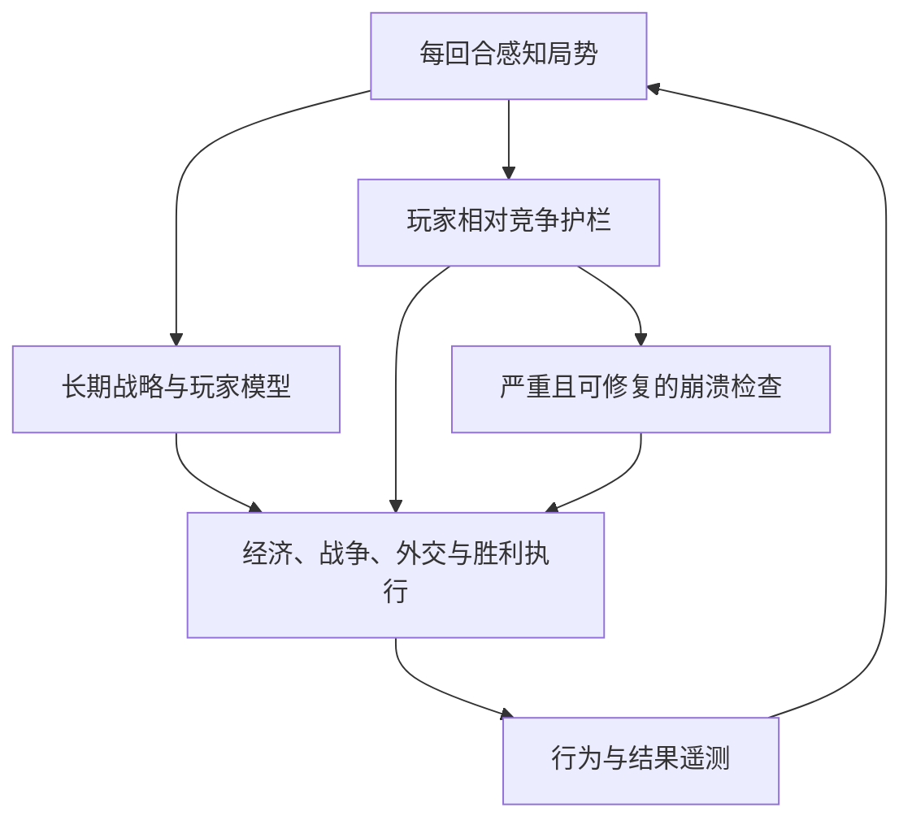

# PvP 式 AI 设计

> 分类：系统设计 | 状态：持续演进 | [返回文档索引](../README.md)

## 1. 目标定义

本项目追求的不是让闭源引擎中的 AI 在微操、寻路和战术搜索上完全等同于人类，而是让玩家长期面对一个能够形成计划、观察局势、集中资源并尝试获胜的对手。理想体验应接近 PvP：

- 对手有可辨认的目标，而不是每回合独立选择当前最高权重项目。
- 对手会观察玩家暴露的机会，并在合理延迟后反应。
- 战争、经济和胜利路线使用同一套资源预算，不会互相无视。
- 对手允许犯错、失败和改变计划，但不会长期重复系统性失能。
- 玩家与 AI 的正常决策都有长期后果，系统不在背后强行改写结果。

## 2. 两层核心与一层保障

优先级固定如下：

1. **自主战略是主体**：AI 先按文明特性、地理、外交和胜利机会决定自己想做什么。
2. **玩家相对调节是护栏**：系统持续检查比赛是否正在过早失去竞争性，只用有限决策权重修复明确短板。
3. **防崩溃是最后保障**：仅在长期严重落后且仍具备恢复基础时介入；被征服、失去领土或战略失败的文明不会凭空复原。

玩家相对比较因此仍是必要机制，但不能成为替 AI 选择全部行动的中央脚本。

## 3. “每回合接近”的工程定义

“接近”指维持一个随游戏阶段收紧的竞争区间，不是把面板数值逐回合复制到同一水平。系统应每回合采样，低频改变决策，并要求差距持续存在：

| 玩家所处阶段 | 允许的综合竞争区间 | 设计原因 |
| --- | ---: | --- |
| 远古/古典 | 88%-125% | 保留开局、地形和文明强势期差异，同时更早阻止持续下滑 |
| 中世纪/文艺复兴 | 90%-120% | 防止中期滚雪球过早结束比赛 |
| 工业时代以后 | 92%-115% | 后期需要稳定存在可信胜利威胁 |

控制规则：

- 每个 AI 每回合记录原始科技、文化、帝国和军事实力比值。
- 决策使用经过上下限控制和指数平滑的比值，原始值同时写入日志，不能用截断后的军力掩盖真实差距。
- 每 4 个标准速度等效回合评估一次；连续 2 次越界才改变状态。
- 状态至少驻留 12 个标准速度等效回合，退出后冷却 8 回合。
- 综合追赶只提供小幅通用纠偏；科技、文化、帝国恢复同时最多激活一个，优先处理最弱支柱。
- 领先状态不得故意压低科技、文化、生产、扩张或奇观选择。它只能停止追赶并把少量注意力转向储备和防御。
- 所有存活主要 AI 都接受相同的监测并拥有完整恢复资格；强度由各自的持续差距和恢复结果决定，不设置全局竞争者名额。

## 4. 自主战略系统

### 4.1 滚动策略组合

游戏局势会持续变化，因此 AI 不应被锁死在单一胜利路线。每个 AI 应保存一个会随新证据滚动更新的策略组合，而不是只保存“当前偏好”或固定终局路线：

- 当前各胜利方向的机会、成本和置信度，可以并行准备但受共同预算约束。
- 主要竞争对手、近期目标与预期收益。
- 经济、扩张、军队、升级和胜利项目的预算比例。
- `准备 -> 投入 -> 评估 -> 继续/撤退` 阶段。
- 计划置信度、已投入成本、转换成本和重新分配预算的条件。

每次评估都允许局势改变方向；战争、外交、玩家威胁、关键区域或胜利里程碑会显著调整权重。系统只抑制没有新证据的短周期抖动，不规定必须坚持某条路线若干回合，也不阻止合理转向。

### 4.2 玩家模型

AI 只能利用正常可观察信息建立玩家画像：

- 区域和建筑结构反映的科研、文化、宗教或经济投入。
- 扩张速度、边境城市、驻军和军事单位角色。
- 战略资源、可见升级、奇观与时代/胜利里程碑。
- 贸易、外交、同盟、谴责、战争和间谍获取的信息。

玩家模型不读取战争迷雾后的单位、未公开队列或未来选择。反应应有延迟和置信度，避免全知式即时克制。

### 4.3 战争生命周期

战争不能继续使用单一“是否处于战争”开关。完整模型需要区分：

- 主要文明战争、城邦战争、宗教冲突和纯防御状态。
- 战争目标、可达路线、目标价值、预计持续时间与可接受损失。
- 前线、远程、攻城、骑兵、防空、海军和支援单位的最低编成。
- 升级与维护预算、集结位置、推进阶段和补员能力。
- 城市攻占、损失交换、行动停滞、撤退与和谈条件。

城邦战争不得触发全帝国常备军、移民和奇观惩罚。0.5.0 已用敌对城市距离和近期可归属战斗排除远方防御条约等“纸面战争”；完整目标、路线、投入与撤退模型仍需后续实现。

### 4.4 经济转化

AI 的经济任务不是追求最高面板产出，而是把产能转化为下一阶段需要的资产：

- 城市按扩张、生产、科研、文化、金币、军工或胜利项目形成软专精。
- 住房、宜居度、区域容量、关键建筑链和高价值地块共同决定城市瓶颈。
- 建造者、商人、移民、单位升级和区域不能由互不相干的权重无限争抢队列。
- 奇观必须结合胜利路线、抢夺概率、城市产能和机会成本判断，不能因任一恢复状态全局禁止。

### 4.5 胜利转化

综合分领先不等于会赢。每条路线都必须记录并驱动实际里程碑：

- 科技：宇航中心、太空项目顺序、项目城市保护和电力。
- 文化：巨作槽位、主题化、国家公园、摇滚乐队、开放边境和国际商路。
- 统治：原始首都、可达目标、攻城编成和占领后的忠诚/防御。
- 宗教：创教、剩余竞争宗教、传教/使徒使用和目标城市。
- 外交：外交胜利点、世界议会、援助竞赛和关键项目。

### 4.6 外交、交易与间谍

PvP 压力还需要非战争互动：

- 根据领先者、共同威胁和胜利方向调整联盟、谴责与联合战争意愿。
- 交易应考虑边际价值、战略资源缺口和是否在资助直接竞争者。
- 间谍任务应针对胜利项目、关键区域、金币需求和反间谍风险。

### 4.7 人类式不完美

AI 不应变成精确读取全图的最优解机器。计划系统需要保留：

- 有限信息和错误置信度。
- 受领袖性格影响的风险偏好。
- 数回合的观察与反应延迟。
- 对已有计划的合理承诺，而不是每次评分变化都瞬间转向。
- 在证据明确时止损，而不是为“坚持个性”无限追加失败投资。

## 5. 公平和数值边界

默认方向仍是决策优先：

- 不生成免费单位、科技、市政、区域、资源或胜利进度。
- 不复制玩家产出，也不因玩家单次行动立即补偿。
- 玩家领先时不让 AI 故意停研、停产、放弃扩张或错过胜利项目。
- 直接数值补助若未来存在，必须是独立配置，有明确上限和日志，不能与决策效果混在一起评价。
- 当前静态神级时代曲线仍属于独立待拆分层，不能用它证明动态控制器有效。

## 6. 0.5.2 已实现范围

当前代码落地了 0.4.0 的稳定性基础、0.5.0 的个体结果闭环、0.5.1 的响应/预算修复和 0.5.2 的多支柱崩塌/换挡修复：

- 每回合采样、速度归一化评估、指数平滑、连续样本确认、最短驻留和冷却。
- 早期/中期/后期三段竞争区间。
- 所有存活主要 AI 使用相同资格独立参与，不设置全局竞争者名额。
- 综合护栏分为轻度和严重落后两档；综合不高于 80% 或第二弱核心支柱不高于 78% 都可进入严重档，均只调整有上限的原生 AI 决策权重。
- 科技、文化、帝国同时只允许一个恢复焦点；运行 20 个标准等效回合后按平滑及原始收益复查，无效焦点退出并只冷却对应支柱，其他候选可在下一次评估完成快速接手。
- 领先状态删除负科技、文化、生产、扩张和奇观权重。
- 主文明战争和城邦/其他次要战争分开；正式主文明战争还需满足前线城市距离或近期可归属战斗，才触发本 Mod 的完整动员。
- 建造者、商人和移民响应计入现役及每座城市当前正在生产的单位；玩法脚本不读取 UI 的未来队列。预算已满时启用对应反压，扩张恢复还受帝国焦点和活跃战争共同约束。
- 奇观惩罚只保留一个主文明战争来源，并从 `-75` 降至 `-35`。
- 修正恢复和文化胜利两套列表中的艺术博物馆与考古博物馆内部类型。
- 评估与指标使用同一回合；日志同时保存原始/受控/平滑比值、第二弱核心支柱、焦点结果、快速换挡状态、扶持档、活跃战争和在产单位。
- SQL 在加载前清理本 Mod 的旧策略记录，防止版本升级后权重残留叠加。

尚未实现：世界分布、完整自身趋势、滚动策略组合、玩家模型、完整战争目标与路线、城市专精、外交/交易/间谍、完整胜利里程碑及静态难度配置拆分。0.5.2 没有固定或锁定胜利路线；游戏原有胜利策略仍可随局势变化。文档描述的滚动组合是后续设计合同，不代表当前版本已经具备。

## 7. 后续实现顺序

1. 用新日志复测固定种子，确认全体 AI 独立参与、双核心严重扶持、快速焦点换挡、在产预算和活跃战争判定符合预期。
2. 加入世界中位数/上四分位与更完整的自身趋势，同时保持所有 AI 的同等参与资格。
3. 建立滚动策略组合、预算和策略冲突矩阵。
4. 完成主要文明战争的目标、准备、投入、撤退和和谈生命周期。
5. 加入城市专精、经济瓶颈和玩家可观察画像。
6. 分路线加入胜利转化遥测与执行器。
7. 最后拆分静态难度配置，用 Vanilla、Decision-only 和完整候选版本做固定种子 A/B。
